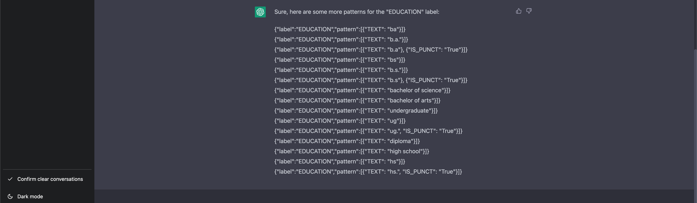

- ## Project Here

  - Resume Praser
  - Product Review analysis
  - Auto coding in python

## To use

<!-- #### you can find tutorial on how to run flask app on `flask Doc`.

#### I use chatGPT to generate a jsonl pipeline for education title extracting and partial copied from Tonson

 -->

----------------

- First, `pip install -r requirement.txt`
- then on bash -> $ `export FLASK_APP=main`
- then $`flask run`

-------------------

## how it work

- I move the code to [another README for EASY search]('#TEMP_README.md')

## code Struceture for my flask web app

```bash
.
├── data_stealer.py                     # Project 1
├── dicKKUtill.py                       # Project 3 code prediction loader
├── form_.py
├── instance
│   ├── create_dir.py
│   └── requirements.txt
├── main.py
├── predickapp                          # PROJECT 3 code prediction 
│   ├── dickUtil.py
│   ├── dicpackage.atikeep
│   ├── predickModule.py
│   ├── predickPyt.py
│   ├── predictor_weight.pt
│   ├── runner.py
│   ├── vocab.pickle
│   └── vocab.txt
├── pySCRPT                             # PROJECT 2
│   ├── LSTM.pt
│   ├── modude_.py
│   ├── __pycache__
│   │   ├── modude_.cpython-310.pyc
│   │   ├── pycache_loader_.cpython-310.pyc
│   │   └── secKey.cpython-310.pyc
│   ├── pycache_loader_.py
│   ├── runner.py
│   ├── secKey.py
│   └── test_praw.py
├── static
│   ├── assets
│   │   ├── css
│   │   │   ├── fontawesome-all.min.css
│   │   │   ├── main.css
│   │   │   └── noscript.css
│   │   ├── js
│   │   │   ├── breakpoints.min.js
│   │   │   ├── browser.min.js
│   │   │   ├── demo.js
│   │   │   ├── jquery.min.js
│   │   │   ├── jquery.scrollex.min.js
│   │   │   ├── jquery.scrolly.min.js
│   │   │   ├── main.js
│   │   │   └── util.js
│   │   ├── sass
│   │   │   ├── base
│   │   │   │   ├── _page.scss
│   │   │   │   ├── _reset.scss
│   │   │   │   └── _typography.scss
│   │   │   ├── components
│   │   │   │   ├── _actions.scss
│   │   │   │   ├── _banner.scss
...
│   │   │   │   └── _wrapper.scss
│   │   │   ├── layout
│   │   │   │   └── _wrapper.scss
│   │   │   ├── libs
│   │   │   │   ├── _breakpoints.scss
│   │   │   │   ├── _functions.scss
│   │   │   │   ├── _html-grid.scss
│   │   │   │   ├── _mixins.scss
│   │   │   │   ├── _vars.scss
│   │   │   │   └── _vendor.scss
│   │   │   ├── main.scss
│   │   │   └── noscript.scss
│   │   └── webfonts
│   │       ├── fa-brands-400.eot
...
│   │       └── fa-solid-900.woff2
│   ├── edu_skill.jsonl
│   ├── files
│   │   └── joke.csv
│   ├── images
│   │   ├── banner.jpg
│   │   ├── francis2.png
│   │   ├── francis.png
│   │   ├── franc.webp
│   │   ├── gallery
│   │   │   ├── fulls
│   │   │   │   ├── 01.jpg
│   │   │   └── thumbs
│   │   │       ├── 01.jpg
│   │   │       └── 12.jpg
│   │   ├── pic01.jpg
│   │   ├── pic02.jpg
│   │   ├── pic03.jpg
│   │   ├── sca.png
│   │   ├── spotlight01.jpg
│   │   ├── spotlight02.jpg
│   │   └── spotlight03.jpg
│   └── skills.jsonl
└── templates
    ├── footer.html
    ├── header.html
    ├── heavyidx.html
    ├── index.html
    ├── index_.html
    ├── stealed2.html
    ├── stealed.html
    ├── __temp_heavyidx.html
    └── upload.html

21 directories, 133 files


```

-----------------------

## System

```bash
root@0746646b7288:~# nvidia-smi
Thu Feb 16 06:27:08 2023       
+-----------------------------------------------------------------------------+
| NVIDIA-SMI 510.47.03    Driver Version: 510.47.03    CUDA Version: 11.6     |
|-------------------------------+----------------------+----------------------+
| GPU  Name        Persistence-M| Bus-Id        Disp.A | Volatile Uncorr. ECC |
| Fan  Temp  Perf  Pwr:Usage/Cap|         Memory-Usage | GPU-Util  Compute M. |
|                               |                      |               MIG M. |
|===============================+======================+======================|
|   0  NVIDIA GeForce ...  On   | 00000000:84:00.0 Off |                  N/A |
| 44%   71C    P2   185W / 250W |   2388MiB / 11264MiB |     95%      Default |
|                               |                      |                  N/A |
+-------------------------------+----------------------+----------------------+
|   1  NVIDIA GeForce ...  On   | 00000000:85:00.0 Off |                  N/A |
| 37%   63C    P2   199W / 250W |   5385MiB / 11264MiB |     56%      Default |
|                               |                      |                  N/A |
+-------------------------------+----------------------+----------------------+
|   2  NVIDIA GeForce ...  On   | 00000000:88:00.0 Off |                  N/A |
| 22%   28C    P8     6W / 250W |      3MiB / 11264MiB |      0%      Default |
|                               |                      |                  N/A |
+-------------------------------+----------------------+----------------------+
|   3  NVIDIA GeForce ...  On   | 00000000:89:00.0 Off |                  N/A |
| 22%   27C    P8     5W / 250W |      3MiB / 11264MiB |      0%      Default |
|                               |                      |                  N/A |
+-------------------------------+----------------------+----------------------+

+-----------------------------------------------------------------------------+
| NVIDIA-SMI 510.108.03   Driver Version: 510.108.03   CUDA Version: 11.6     |
|-------------------------------+----------------------+----------------------+
| GPU  Name        Persistence-M| Bus-Id        Disp.A | Volatile Uncorr. ECC |
| Fan  Temp  Perf  Pwr:Usage/Cap|         Memory-Usage | GPU-Util  Compute M. |
|                               |                      |               MIG M. |
|===============================+======================+======================|
|   0  NVIDIA GeForce ...  Off  | 00000000:01:00.0  On |                  N/A |
| N/A   46C    P5    15W /  N/A |     82MiB /  6144MiB |     34%      Default |
|                               |                      |                  N/A |
+-------------------------------+----------------------+----------------------+


```
