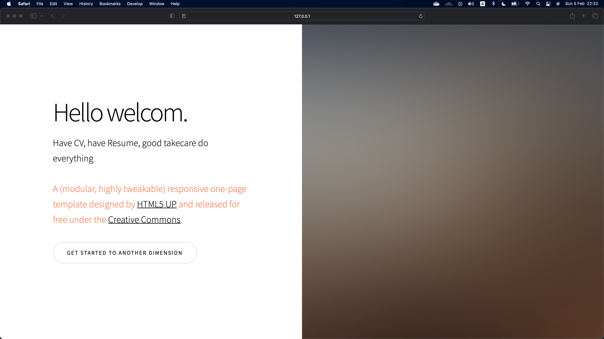
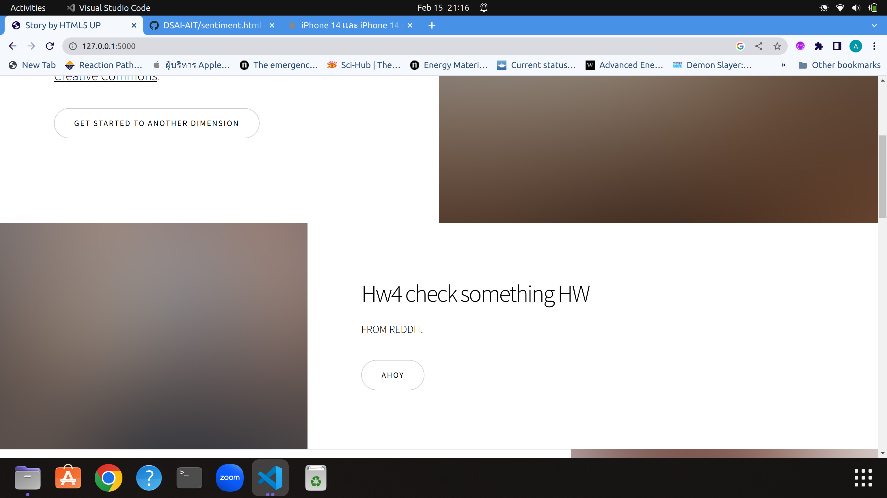
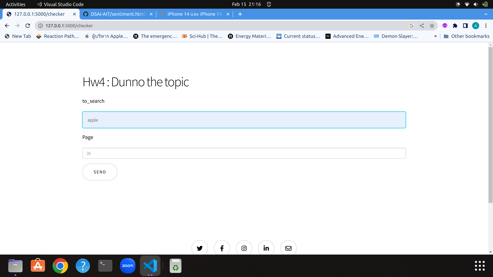
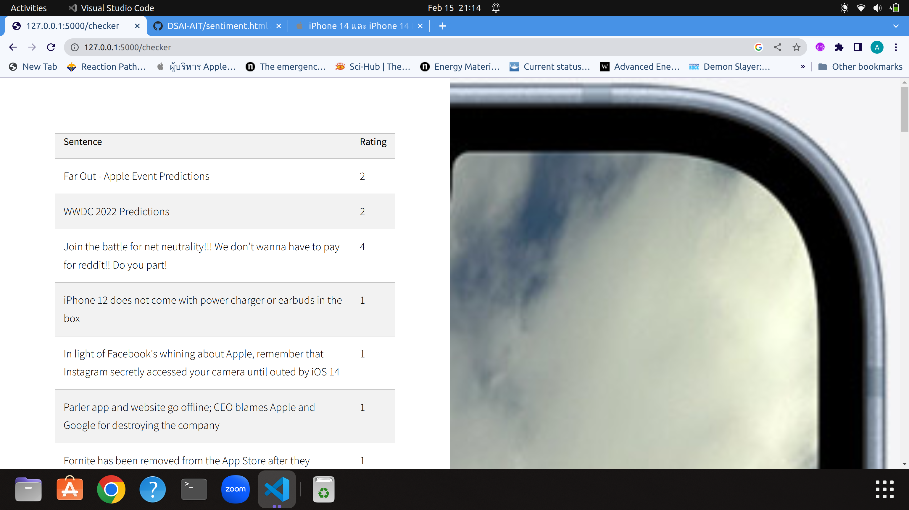
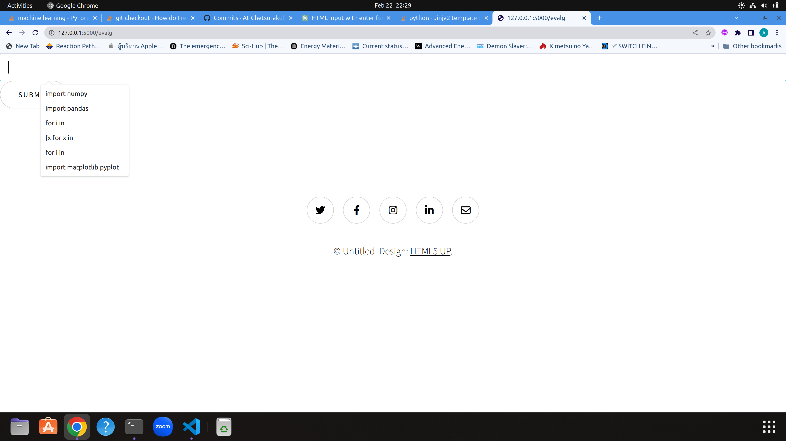
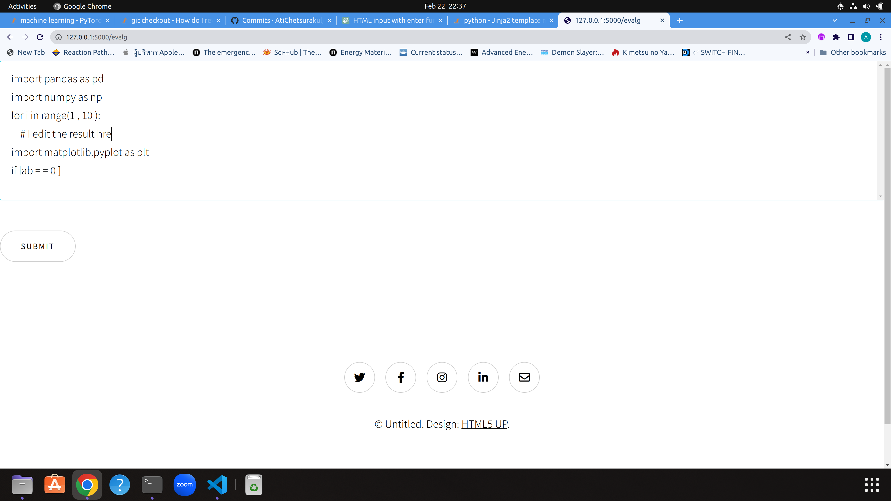
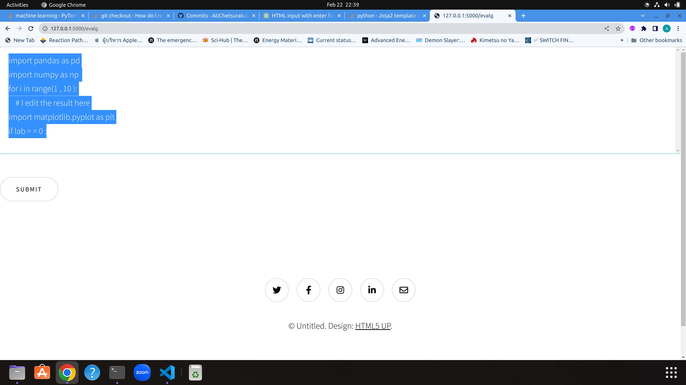

- ## Project Here

  - Resume Praser
  - Product Review analysis
  - Auto coding in python
  - Translator

- ### Homepage

 

-------------------------

- ## Project1 Resume Stealer

- ### UploadPage


- ### File uploading


- ### Result


---------------

- ## Project2 Tweet to review product
<!-- - ### I have 2 excute


- ### second one


- ## Maybe we should sent email to `Elon Musk` to sell `twitter` out or just let it went bankrupt. Since he do something in TWITTER API and that will not be free anymore T-T . -->

<!-- - ## Anyway, we still have our freind REDDIT -->
### So our site now is like



- ### Our form for this hw


- ### and this is result



-----------------------

- ## Project 3

- Our site are now add new feature


- How it work?




- with this doc

``` html
<form action="/evalg" method="post">
    
    <textarea type="text" name='old' style="border:none; outline:none;" id="input-field2"
        oninput="resizeTextarea()">{{generate}}</textarea>
    
    <input type="text" name='dick' style="border:none; outline:none;" id="input-field" />
    <button type="submit">Submit</button>
</form>
<script>

    function generateRandomString(length) {
        let result = '';
        const characters = 'ABCDEFGHIJKLMNOPQRSTUVWXYZabcdefghijklmnopqrstuvwxyz0123456789';
        const charactersLength = characters.length;
        for (let i = 0; i < length; i++) {
            result += characters.charAt(Math.floor(Math.random() * charactersLength));
        }
        return result;
    }
    const inputField = document.getElementById("input-field");
    inputField.addEventListener("keyup", function (event) {
        if (event.keyCode === 13) {
            const inputValue = inputField.value;
            const randomString = generateRandomString(5); // Change the length as per your requirement
            inputField.value = `${inputValue} ${randomString}`;
        }
    });

    function resizeTextarea() {
        const textarea = document.getElementById("input-field2");
        textarea.style.height = "1px";
        textarea.style.height = (25 + textarea.scrollHeight) + "px";
    }

</script>
<style>
    #input-field2 {
        resize: none;
        height: 500px;
        overflow-y: scroll;
    }
</style>
```

- An Editable n stackable result are show as this  





------------------------------

## Translator Project

- TH -> ENG translator


-------------------------------
- CODE Auto Complete with `Transformer and Beamsearh`


